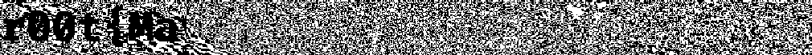
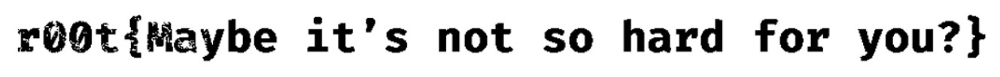

# strange XSB

- 出题人: pyy

- 验题人: pyy(但没考虑到pad)

## 题目描述

一张非常喜欢的图, ~~拿来水个题~~。

(后来新增了`提示: 照片是出题人拍的, 以图搜图找不到。由于jpg的有损压缩特性所以增大了加入flag的像素范围(因为已经不是LSB最低有效位了, 所以不清楚该叫什么了)`)

## 出题思路

思路来源于之前做过的一道隐写题(没做出来)。当时是一张照片, 在最低位有一个flag的前半段, 后半段全是噪点完全看不出来。当时的思路是在网上找到这张图, 然后进行异或。(虽然这个思路有问题但这不妨碍出题啊)

于是就有了这题。题目简介中以`非常喜欢`的图为提示, 旨在引人想到要社工出题人, 然后发现一张熟悉的图片, 下载后异或得出flag。(其实一般人看到就会直接略过去了, 后来自己看也觉得确实有些隐晦, 但此时已经有人大气的买下了hint, 所以出于公平的考虑选择在hint中直接说去出题人的qq看一眼)

于是就将一张风景图片上传到了qq背景处, 然后下载后进行flag的插入。

实际上经过粗略测试(比赛中)发现ios与安卓系统上的qq都是下载的同一张图片, 因此在最低位隐写也可以异或出清晰的flag。(因为jpg是同一张, 而导出的图片用的是png格式, 也就是无损压缩格式) 但中途发现ipad下载的jpg和手机上的不同, 于是紧急进行了图片的替换, 题目也由LSB变为XSB。

## 解法

### 预期解法

使用stegsolve打开, 发现在三通道的低四位上都存在如下图像信息:



然后去社工出题人, 发现在其qq名片上的背景处有这张图片, 点进去长按下载, 发到电脑上。

写python脚本进行图像处理:

```python
import cv2
import numpy as np
from itertools import product

lsb=15
if __name__ == '__main__':
  flagImg=cv2.imread("out.png",1)
  sourceImg=cv2.imread("qq.jpg",1)
  for y,x in product(range(flagImg.shape[0]),range(flagImg.shape[1])):
    if (flagImg[y,x]-sourceImg[y,x]<lsb).all():
      flagImg[y,x]=np.full((3),255,np.uint8)
    else:
      flagImg[y,x]=np.full((3),0,np.uint8)
  cv2.imwrite("ans.png",flagImg)
```

然后拿到flag图片:



### 非预期

然后做出这题的同学告诉我, 原来stegsolve可以直接异或。

Analyse->Image Combiner->选qq里下的图片


有些暗, 调亮点看(这么说的话, 如果按照原题LSB, 应该是看不到了233)

