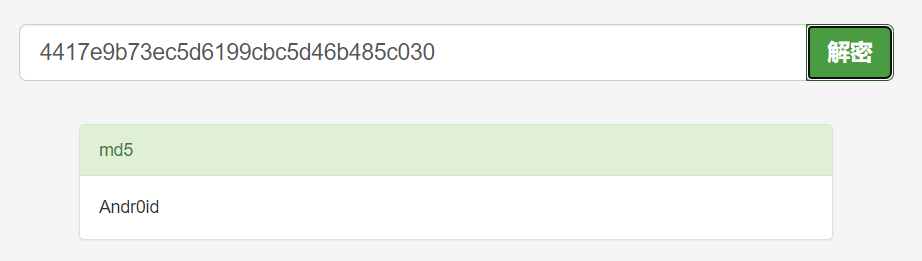
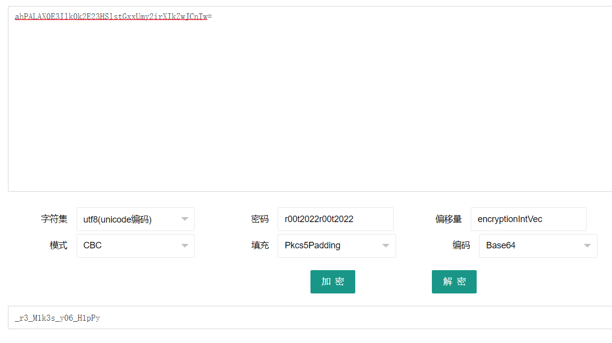

# BabyAndroid

---

提示了三样东西

* jadx：一款安卓反编译利器，同时支持命令行和图形界面，能以最简便的方式完成apk的反编译操作。
* md5：Message-Digest Algorithm 5
* AES：Advanced Encryption Standard

直接把 apk 拖进 jadx，通过 AndroidManifest 寻找入口函数（当然直接找也很容易，com.example.myapplication 这个包是不是看上去就非常可疑？）

定位到关键代码：

> public void onClick(View view) {
>             String obj = MainActivity.this.username.getText().toString();
>             String obj2 = MainActivity.this.password.getText().toString();
>             if (obj.equals("") || obj2.equals("")) {
>                 Toast.makeText(MainActivity.this, "信息不能为空", 0).show();
>             } else if (!obj.equals("admin")) {
>                 Toast.makeText(MainActivity.this, "用户名错误", 0).show();
>             } else {
>                 System.out.println(obj2.length());
>                 if (obj2.length() != 32) {
>                     Toast.makeText(MainActivity.this, "长度不对", 0).show();
>                     return;
>                 }
>                 String substring = obj2.substring(0, 5);
>                 String substring2 = obj2.substring(5, 12);
>                 String substring3 = obj2.substring(12, 31);
>                 if (!substring.equals("r00t{") || obj2.charAt(31) != '}' || !md5.md5(substring2).equals("4417e9b73ec5d6199cbc5d46b485c030") || !encrypt.AESEncode("AES/CBC/PKCS5Padding", substring3).equals("ahPALAX0E3Ilk0k2E23HSlstGxxUmy2irXIkZwJCnTw=")) {
>                     Toast.makeText(MainActivity.this, "密码错误", 0).show();
>                 } else {
>                     Toast.makeText(MainActivity.this, "恭喜，登录成功！", 0).show();
>                 }
>             }
>         }

分析一下发现 用户名是 "admin"，密码 password 被拆分成三部分：

* password 以 "r00t{" 开头，以 "}" 结尾
* md5 加密 password [5,12)，结果是 "4417e9b73ec5d6199cbc5d46b485c030"
* AES 加密 password  [12,31)

md5直接找个[免费解密网站](https://www.somd5.com/)解一下就可以了

AES部分关键代码：

> ## MainActivity
>
> encrypt.AESEncode("AES/CBC/PKCS5Padding", substring3).equals("ahPALAX0E3Ilk0k2E23HSlstGxxUmy2irXIkZwJCnTw=")
>
> ## AESEncode
>
> SecretKeySpec secretKeySpec = new SecretKeySpec("r00t2022r00t2022".getBytes(), "AES");
> Cipher instance = Cipher.getInstance(str);
> instance.init(1, secretKeySpec, new IvParameterSpec("encryptionIntVec".getBytes()));
> return Base64.encodeToString(instance.doFinal(str2.getBytes(StandardCharsets.UTF_8)), 8).substring(0, 44);

这里可能需要对加解密参数有非常基础的了解（即能看得懂英文），从代码中提取各种参数，再次白嫖个[在线网站](http://www.hiencode.com/caes.html)，输入如下参数，解密即可：

