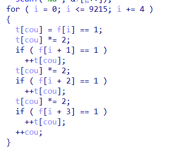
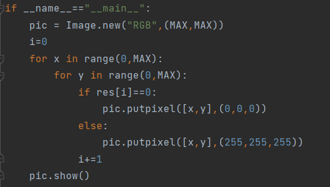
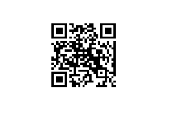

仔细读题，你就能被谐音梗带上正确的道路。zebra即斑马，斑马身上只有黑白两种颜色，降维打击的斑马，就变成了二维“马”。没错，本题的重要线索是，最终结果会是一个二维码。

将zebra拖入ida种分析，就可以得到大致逻辑，

首先==的优先度大于=，所以将表达式f[i]==1的结果赋值给t[cou]，即当f[i]为时，t[cou]为1，f[i]为0则t[cou]为0。

再将t[cou]乘2，可以视为左移一位。

那么整体代码逻辑就出来了，将四个1或者0压缩成一个数。最后和给定的数组对比，如果正确就给出提示Now you can go further with \"from PIL import Image”。

也就是说，我们只需要从给出的数组逆向解压出输入的01二进制串。

那么01二进制串和二维码还有pil有什么关系呢。仔细观察可以发现，这个01字符串存储在一个9216长度的数组中，而9216=96\*96，为什么不试着把01排列成96\*96的尺寸，每个01代表一个或黑或白的像素点呢？(9216这个数字肯定是有特殊含义的，解题过程中需要多尝试)
ida使用小技巧：使用shift+e快捷键可以从Ida中提取出想要的数据。这题写脚本时需要用到给定的t[]数组中数据来进行逆向。

另外，还有同学反映在自己的ida里出现了长度为4069的数组（根据ida版本不同，反编译得到的结果也会有差异），其实是将给定的t[]和我们输入后压缩成的v[]结合在一起识别为了一个更大的数组
，原因相信大家都猜到了，这两者在栈空间里是紧贴着的，所以被ida识别为了同一个数组。这一点可以通过在ida中修改对应数组长度来改进，反编译代码会更直观。

还原出01串后，使用pil的函数putpixel()绘图即可（其他绘图函数亦可）。

