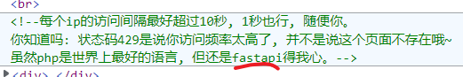
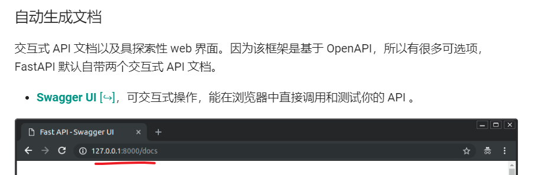
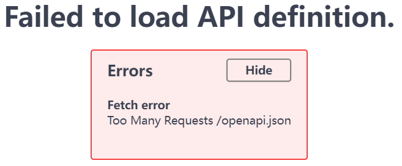
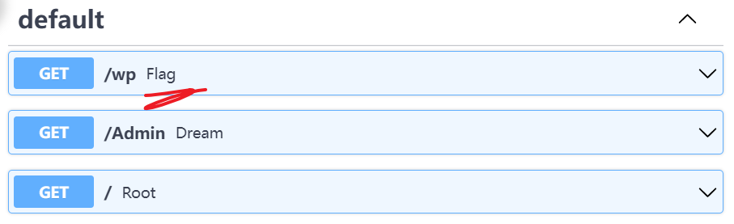
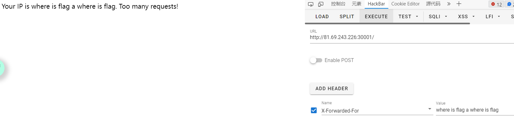
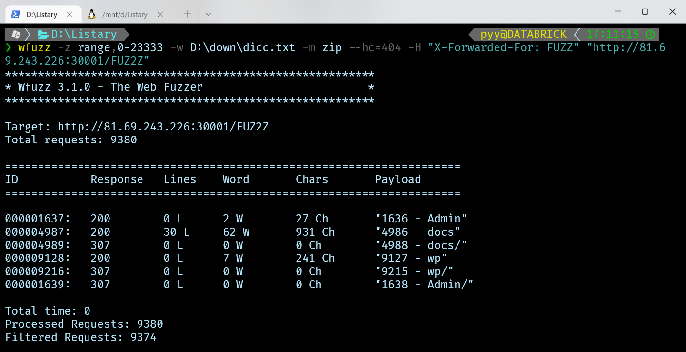

# find_the_flag

- 出题人: pyy

- 验题人: pyy

## 题目描述

flag就藏在这个网站的某个`常见`的目录下......

不过这个网站好像对访问速度做了一些限制?

字典免费送, 请把良心打在留言板上。

## 出题思路

目录扫描题, 原意为考核dirsearch, 但结合了限制访问次数以及换ip后变为脚本/工具发包题了。(因此ezDirsearch改名为本题目, 指向--, 难度++)

## 解法

### 预期解1

`.\dirsearch.py -u http://81.69.243.226:30001/ --delay=1 --threads=1`

五个小时, 硬扫就完事了。


可能会这样看着没反应, 但其实去看他的log是有的, 那么有就完事了。(五个小时, 不扫了)

### 预期解2

f12一发, 发现



看一眼fastapi文档, 发现直接显示接口的页面



访问一下, 发现它还会请求/openapi.json, 而此时超过了一秒一次的限制, 报了429.




(如果此时加载js超过1秒, 那就不会触发429, 可以直接看到)



访问/wp获取flag。

要是不幸没能加载出来, 那就直接访问openapi.json, 就可以了。

```
{"openapi":"3.0.2","info":{"title":"FastAPI","version":"0.1.0"},"paths":{"/wp":{"get":{"summary":"Flag","operationId":"flag_wp_get","responses":{"200":{"description":"Successful Response","content":{"text/html":{"schema":{"type":"string"}}}}}}},"/Admin":{"get":{"summary":"Dream","operationId":"dream_Admin_get","responses":{"200":{"description":"Successful Response","content":{"text/html":{"schema":{"type":"string"}}}}}}},"/":{"get":{"summary":"Root","operationId":"root__get","responses":{"200":{"description":"Successful Response","content":{"text/html":{"schema":{"type":"string"}}}}}}}}}
```

### 预期解3

好了, 上面两种讨巧的讲完了, 来点正经的。


如果访问频率过多就会出现这个, 猜测是通过ip限制访问频率。

于是去搜一发怎么伪造ip, 发现可以伪造X-Forwarded-For头。



用hackbar测试一下, 是可以的。

然后用python或者burp应该都可以。(python如果写同步单线程的话会比较慢(比一秒一个包快5倍吧?), burp好像需要换迭代器来着)

其实python有别人写好的线程池可以拿来用, 可以搜一下HackRequests。

但是这里用WFUZZ做示范: (-m是迭代器模式, 默认是两个for循环但这里改成两个迭代器一起++; --hc是忽略404; -H是加头(?))



扫出了wp目录, 进去访问一下flag就到手了。
