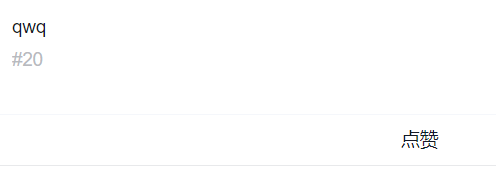
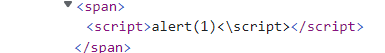
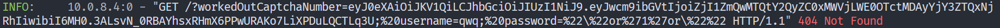
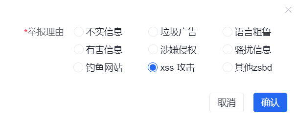
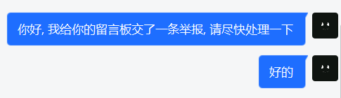
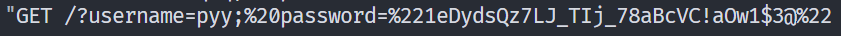
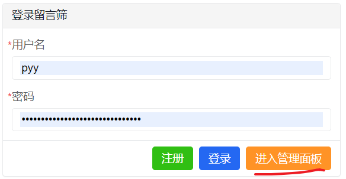
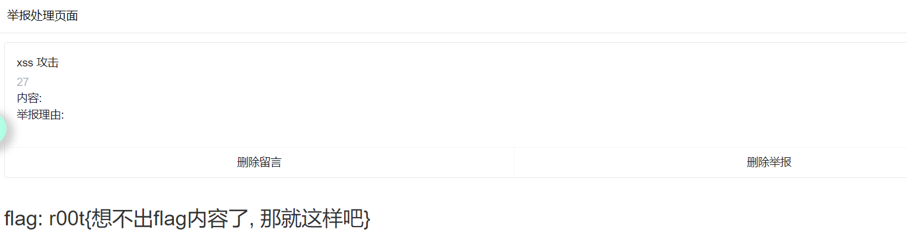

# 免费的留言板

- 出题人: pyy

- 验题人: pyy

## 题目描述

免费提示:

- 咦, 这个题的中文名是不是翻译错了?

- ezSQL的flag仿佛名显玄机

  36分提示:

- 这个留言板怎么还可以发图片和按钮的?

- 登录界面好像还藏了一个管理员界面的按钮......藏哪了?

- 一切还是要等拿到管理员账户和密码后再说.......

## 出题思路

Java课要写个留言板, 于是那时候整了一个, 然后玩的时候发现可以搞一个经典的xss盗号。后来弄弄就有了这道题。(虽然前端也重写了, 后端也重写了, 还写了个amis前端热部署, 总之就是全重写了一遍) 实际上这题的前端是从数据库里动态生成的(amis一段json就能搞定, 至于效率, 管他呢), 所以原本是有另外一个钓鱼解法的(把前端页面的登录api改成自己的服务器, 这样就可以拿到所有登陆的人的用户名和密码), 但是怕有人瞎改(不瞎改就怪了, 谁知道这里面该写什么), 所以加了个复杂密码的验证, 相当于ban掉了。

与Counterattack联动环节: 有一个人发了贪吃蛇的按钮, 进去之后点左上角的`回到首页`, 会有一个和比赛几乎相同的登录页面。在这里输入正确的密码则会被钓鱼, 然后服务器会登录你的账户提交-100分的flag。

## 解法

### 预期解法

(说起来, 你们看到别人在留言板里发图片和按钮而没见着传图片啥的, 不觉得奇怪吗?)

既然有人发按钮了, 那一定是有xss。(然后拿到管理员cookie就可以了)

先试着搞一波简单的script标签:

`<script>alert(1)<\script>`





发现没有显示出来但f12里有(说明没有被套标签), 但同时也没有弹框。(由于这个script是后来生成的而不是一开始就有的, 所以不会被执行。就像你f12往里加script标签一样。不同的是, 如果你加的是``, onerror里的代码就会被执行。)

```python
import fastapi
import uvicorn
app=fastapi.FastAPI()
if __name__=="__main__":
  uvicorn.run("pyy:app",host="0.0.0.0",port=60080)
```

fastapi起一个服务器, 反正只需要log功能所以啥也不用写。之后再开一个内网穿透, 这样cookie可以打过来。

然后用onerror写一个img标签进去, 然后src为我们的网站+get传cookie。

``



收到了, 虽然里面有robot题的cookie, 接下来就是钓管理员上钩。(我钓我自己还有不成功的吗?)

首先交个举报, 说这条留言有问题。这样管理员就会来看这条留言。然后我们就拿到了cookie。





这样就上钩了。



然后拿着密码去登录:



发现多出来一个按钮, 那就进去看看吧。


